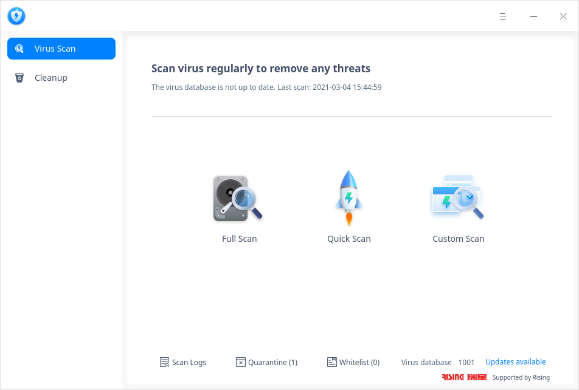
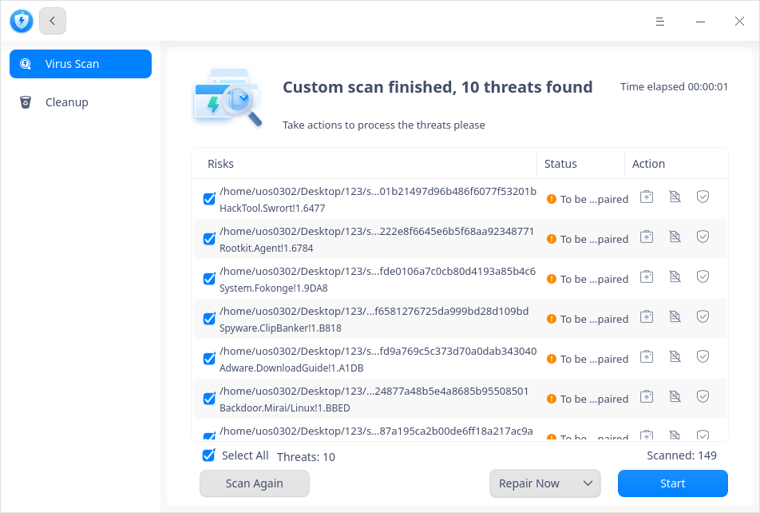
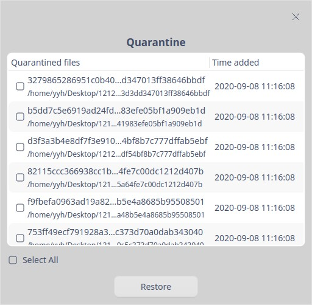
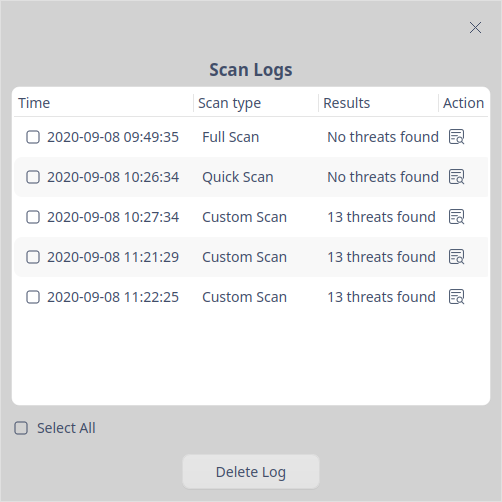
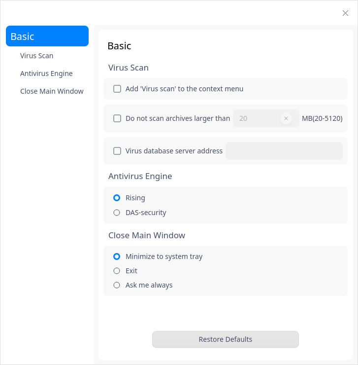

# Security Center|deepin-defender|

## Overview 

Security Center is an application that provides virus scanning and junk cleaning.

## Guide

You can run, close and create a shortcut for Security Center by the following ways.

### Run Security Center

1. Click  on dock to enter Launcher interface.
2. Locate  by scrolling mouse wheel or searching by "Security Center" in Launcher interface. Click  to run. An authentication window pops up. Please input the password to go on.

3. Right-click , you can

   - Click **Send to desktop** to create a desktop shortcut.
   - Click **Send to dock** to fix the application on dock.
   - Click **Add to startup** to add it to startup, it will automatically run when the system starts up.

### Exit Security Center

- On Security Center interface, click  to exit.
- Right-click  on Dock, select **Close All** to exit.
- Click  and select **Exit**.

## Operations

### Virus Scan
#### Scanning

Security Center supports full scanning, quick scanning, and custom scanning.

1. On the homepage, click **Virus Scan** in the left panel, and select a scanning method. After scanning finishes, you will see the result.

2. According to the result, you can choose corresponding operations to one or multiple results.

   **Singularly Operation:**

   Repair: click , this risk will be fixed, and it won't be diagnosed as a risk for the next time.

   Quarantine: click , this risk will be quarantined, other files would not be affected. It won't be diagnosed as a risk for the next time. You can click **Quarantine** icon below to view it. 
   
   Trust: click , this risk will be trusted. It won't be diagnosed as a risk for the next time. You can click **Whitelist** icon below to view it. 
   
   **Batch Operation:**
   
   Check all risks you want to deal with, select **Repair Now**, **Quarantine Now** or **Add to Whitelist** from the drop-down box, and then click **Start**. 

#### Quarantine
On the interface of Virus Scan, you can click **Quarantine** icon below to view the list of quarantined files, and click **Restore** to move them out of it.

#### Whitelist
On the interface of Virus Scan, you can click **Whitelist** icon below to view the list of quarantined files, and click **Remove** to move them out of it.

#### Scan Logs
On the interface of Virus Scan, you can click **Scan Logs** icon below to view scanning time, scan type, results and action. Click  to view details and you can also delete logs.

#### Virus database update

New virus keep coming out everyday. So your virus database should be regularly updated to satisfy the security needs of your computer.

On the interface of Virus Scan, whenever there is a new virus database, you can click **Updates available** in the lower right corner to choose whether to update it. 

### Cleanup

Operating system will produce all kinds of junks in the daily operation. When more and more junks are generated, the efficiency of the system will be affected, and disk resources are wasted. It is suggested to clean up the garbage regularly to ensure the smooth operation of the system and improve the utilization rate of resources.

1. Open Security Center and select **Cleanup** in the left panel to enter the garbage cleaning interface.

2. Check the corresponding garbage type. Currently, you can choose to clean up system junk, application junk, traces and cookies.

3. Click **Scan Now** to enter the scanning interface.

4. After scanning, the junks found in scanning can be viewed and disposed accordingly.

   - Clean up: clean up all the selected junks. You can also cancel or check more options.
   - Back: return to the cleaning interface without any processing.

5. Click **Done** after cleaning. You can also click **Cancel** during cleaning up.

## Main Menu

You can set relevant parameters, switch themes, view manual and version information in Main Menu.

### Settings

Click on the interface. Select **Settings**.

#### Basic

**Virus Scan**
- Add "Virus scan" to the context menu: after you check this option, when you right-click a folder, you can select **Virus scan**.
- Do not scan archives larger than xxxMB(20-5120): after you check this option, if a package is larger than the size you set here, it won't be scanned.
- Virus database server address: after you check this option, you can set the address for virus database updating.

**Antivirus Engine**

You can choose "Rising" or "DAS-security".

**Close Main Window**
   - you can click **Minimize to system tray**. When you close the main window, it will be minimized to system tray.
   - you can click **Exit**. When you close the main window, you will exit Security Center directly.
   - you can click **Ask me always**. When you close the main window, the system will pop up a query to get your confirmation.

#### Restore Defaults

Click **Restore Defaults** button to restore the current page to defaults.

### Theme

The window theme includes Light Theme, Dark Theme and System Theme.

1. Click on the interface.
2. Click  **Theme** to select one.

### Help

View the manual to help you further know and use Security Center.

1. Click on the interface.
2. Click **Help** to view the manual.

### About

1. Click on the interface.
2. Click **About** to view version information and introduction about Security Center.

### Exit

1. Click on the interface.
2. Click **Exit**.

